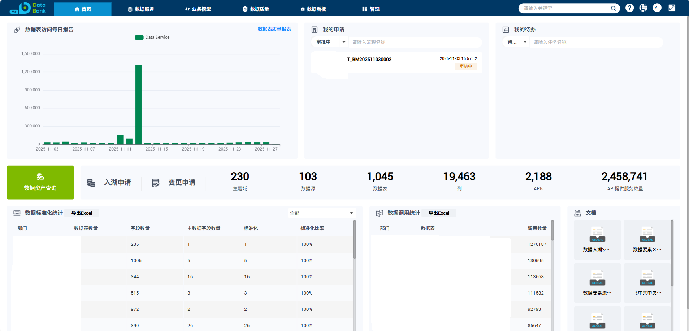
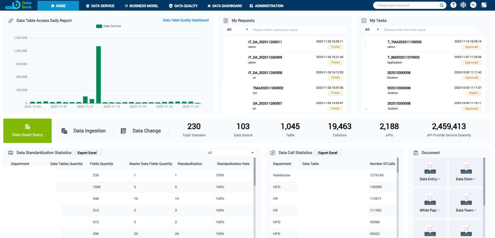
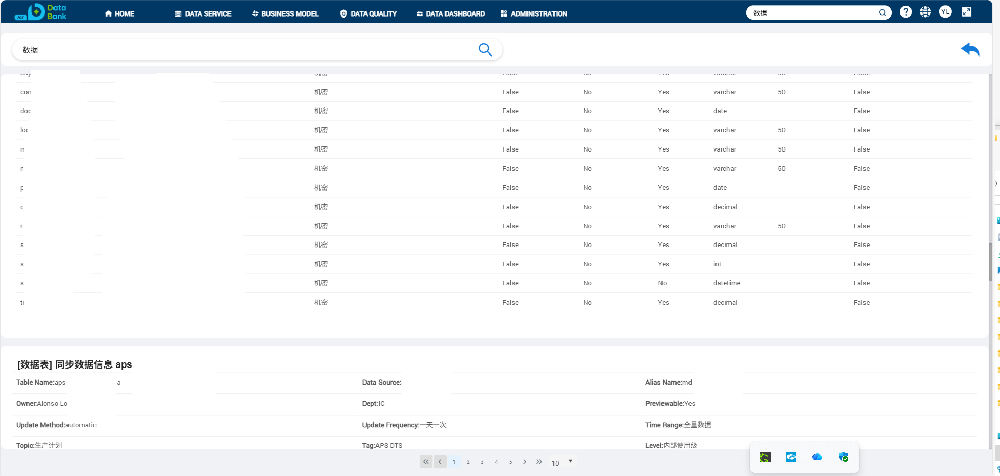

# 数据资产管理系统

## 项目概述
- 提供企业级数据资产全生命周期管理解决方案
- 包含数据目录、元数据管理、数据API、权限控制、业务模型、数据质量等核心功能
- 基于微服务架构，前后端分离开发
- 生产期间抵御了三小时内130w次其他服务器异常调用,最高峰值超7k次/秒，系统正常运行无异常，无数据丢失，所有请求响应都非常快速，无明显延迟。事后查看服务器资源使用记录情况，内存占用无明显变化。

## 主要功能模块
### 后端服务
- 数据资产管理核心服务
- 元数据管理服务
- 数据搜索服务
- 数据流程管理
- 权限管理服务
- 数据质量监控服务
- 业务模型管理服务

### 前端应用
- 数据资产目录可视化
- SQL查询界面
- 主数据管理
- 数据授权管理
- 数据访问日志
- 数据质量监控管理
- 业务模型管理

## 技术栈
- 后端：.NET 8,Furion,SqlSugar, Dapper, 微服务架构
- 前端：Angular, PrimeNG，ECharts,Ant Design
- 数据库：PostgreSQL,MySql,MsSql,Oracle,SQLite
- 中间件：Nginx,Redis,Elasticsearch,Consul,Ocelot
- 部署：Docker容器化

## 快速开始
```bash
# 后端服务启动
cd src/backend/DataAssetManager.NorthAsia.HUA
dotnet run

# 前端应用启动
cd src/frontend/MiddlePlatformSystem
npm install
npm start
```

## 开发指南
- API文档：/swagger
- 前端组件库：jabil-bus-lib
- 多语言支持：中英文切换

## 贡献方式
- 提交Pull Request到dev分支
- 遵循现有代码风格
- 更新相关文档和测试用例


## 界面`UI`
- 主界面
<p align="center">
  
  
  
</p>
